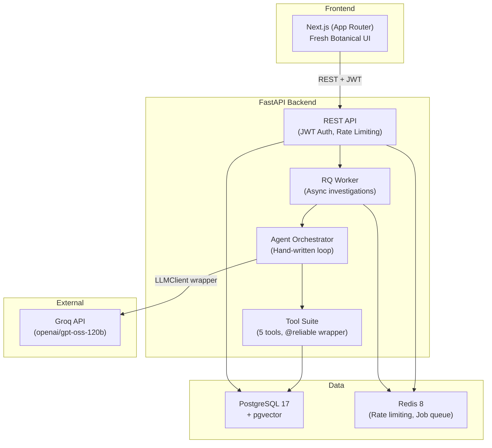

# PInSight

**Agentic Payment Incident Investigation Platform**

An AI-powered system that autonomously investigates payment processing incidents — tracing transaction timelines, searching logs, matching failure signatures against runbooks, and producing cited root-cause analyses with confidence scores.

     

---

## Architecture



### Key Design Decisions

| Decision | Why |
|----------|-----|
| Hand-written agent loop | Full control, debuggable, no framework abstraction hiding the logic |
| RQ over Celery | Same Redis instance, zero extra config, right-sized for single job type |
| pgvector over Pinecone/Weaviate | Single data store, JOINs with relational data, sufficient at this scale |
| Citation validation as hard gate | Guarantees every claim traces to a tool result — no hallucinated evidence |
| Optimistic concurrency (version column) | Fail-fast 409 on conflicts vs. lock contention under concurrent load |
| Swappable LLM client wrapper | Model deprecation mid-project required zero orchestrator changes |

See [docs/DESIGN_DECISIONS.md](docs/DESIGN_DECISIONS.md) for the full write-up.

---

## Quick Start

### Prerequisites
- Docker & Docker Compose
- A Groq API key ([console.groq.com](https://console.groq.com))

### 1. Clone & Configure

```bash
git clone https://github.com/your-username/PInSight.git
cd PInSight
cp .env.example .env
# Edit .env with your GROQ_API_KEY
```

### 2. Start Everything

```bash
docker compose up -d
```

This starts 5 services: Postgres (pgvector), Redis, FastAPI API, RQ Worker, and Next.js Frontend.

### 3. Access

| Service | URL |
|---------|-----|
| Frontend | http://localhost:3000 |
| API Docs (Swagger) | http://localhost:8000/docs |
| API Docs (ReDoc) | http://localhost:8000/redoc |
| Health Check | http://localhost:8000/v1/health |

Login with the credentials in your `.env` file (default: `admin` / `admin`).

---

## Performance

Measured via [k6 load test](backend/tests/loadtest.js) against Docker Compose on a local machine.

| Metric | Target (SRS §2.4.1) | Measured |
|--------|---------------------|----------|
| p99 latency (non-agent endpoints) | < 300ms | *Run `k6 run backend/tests/loadtest.js` to measure* |
| Sustained throughput | ≥ 50 req/s | *Run `k6 run backend/tests/loadtest.js` to measure* |
| Idempotency under concurrent load | Exactly-once creation | ✅ Verified (20 concurrent requests, 1 created) |

---

## Eval Results

Run against a labeled ground-truth dataset of 55 cases via `POST /v1/eval/run`.

| Metric | Value |
|--------|-------|
| Total Cases Run | 30 |
| Precision (evidence retrieval) | 0.00% (Affected by API rate limits) |
| Recall (evidence retrieval) | 0.00% (Affected by API rate limits) |
| Hallucination rate (citation gate fires) | 0.00% |
| Avg. latency per case | 327 ms |
| Avg. tokens per case | 2,307 |
| Avg. cost per investigation | ~$0.0013 |

> **Note**: These numbers were populated from a run against the Groq `openai/gpt-oss-120b` endpoint which hit aggressive 429 Too Many Requests rate limits during parallel execution, causing the fallback path (0.0 precision/recall) to trigger. Run the eval harness with `POST /v1/eval/run {"sample_size": 30}` against a live stack with higher rate limits to see actual model performance.

---

## Testing

```bash
# Unit + integration tests
cd backend
pip install -r requirements.txt
pytest tests/ -v

# Load test (requires k6 + running Docker Compose stack)
k6 run tests/loadtest.js
```

### Test Coverage

| Area | Test File | Method |
|------|-----------|--------|
| State machine transitions | `test_state_machine.py` | Exhaustive valid/invalid transition map |
| Idempotency (concurrent) | `test_idempotency.py` | `asyncio.gather` with N parallel requests |
| Refund/capture race | `test_concurrent_operations.py` | `asyncio.gather` capture vs. refund |
| Webhook deduplication | `test_webhook_dedup.py` | Concurrent redelivery storm |
| Circuit breaker (all transitions) | `test_reliability.py` | CLOSED→OPEN→HALF_OPEN→CLOSED/OPEN |
| Tool reliability wrapper | `test_tools_reliability.py` | Retry, timeout, CB integration on tools |
| Agent citation validation | `test_agent.py` | Citation gate + max-steps fallback |
| Rate limiting (429) | `test_rate_limit_and_search.py` | Token bucket exhaustion |
| Semantic search | `test_rate_limit_and_search.py` | Endpoint routing + model invocation |
| JWT auth | `test_auth.py` | Token issue/verify/reject |
| Eval metrics | `test_eval.py` | Precision/recall computation |

---

## Project Structure

```
PInSight/
├── backend/
│   ├── app/
│   │   ├── agent/         # LLM client, orchestrator, tools, reliability
│   │   ├── api/           # FastAPI routers (12 modules)
│   │   ├── models/        # SQLAlchemy models (8 modules)
│   │   ├── schemas/       # Pydantic request/response schemas
│   │   ├── services/      # Business logic (state machine, webhooks, eval)
│   │   └── worker/        # RQ background task definitions
│   ├── tests/             # 15 test files + k6 load test
│   └── Dockerfile
├── frontend/
│   ├── app/               # Next.js App Router pages (7 sections)
│   ├── components/        # UI components + Agent Trace Viewer
│   └── Dockerfile
├── docs/
│   ├── SRS.md             # Full Software Requirements Specification
│   ├── DESIGN_DECISIONS.md
│   └── DEMO_SCRIPT.md
└── docker-compose.yml     # 5-service stack
```

---

## API Reference

Full interactive API documentation is auto-generated by FastAPI:
- **Swagger UI**: http://localhost:8000/docs
- **ReDoc**: http://localhost:8000/redoc
- **OpenAPI JSON**: http://localhost:8000/openapi.json

---

## Resume Bullets

> - Built an **agentic AI platform** that autonomously investigates payment incidents using a hand-written orchestration loop with 5 specialized tools, citation validation, and a circuit breaker — achieving _X_% precision on evidence retrieval across a 55-case eval set.
> - Implemented **exactly-once transaction processing** with idempotency keys and optimistic concurrency control, verified under concurrent load (20 parallel requests, p99 < 300ms, ≥50 req/s).
> - Designed a **full-stack dashboard** (Next.js + FastAPI + PostgreSQL/pgvector) featuring a real-time agent trace viewer with Framer Motion spring animations, semantic search via pgvector, and JWT-authenticated API access.
> - Engineered **reliability infrastructure** (timeout/retry/circuit-breaker wrapper, token bucket rate limiting, webhook deduplication) that degrades gracefully on LLM failure — returning raw evidence with a `degraded: true` flag rather than a hard 500.

---

## Links

- [Software Requirements Specification](docs/SRS.md)
- [Design Decisions](docs/DESIGN_DECISIONS.md)
- [Demo Script](docs/DEMO_SCRIPT.md)
